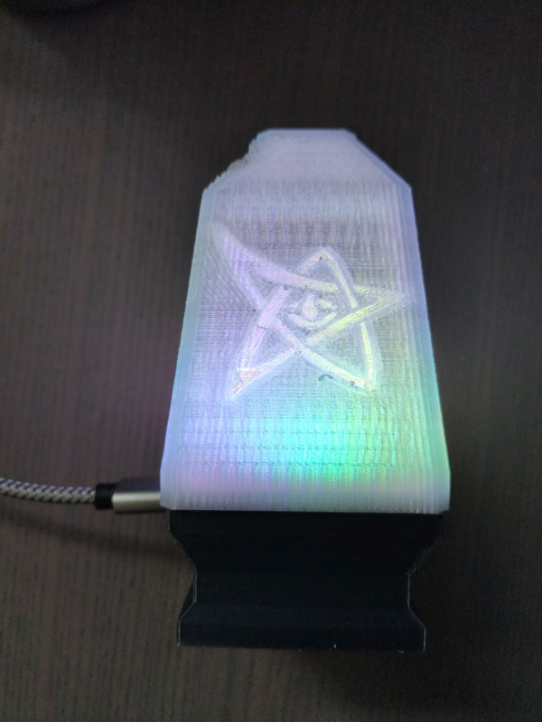
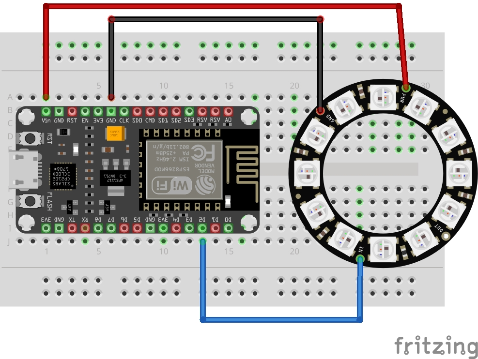
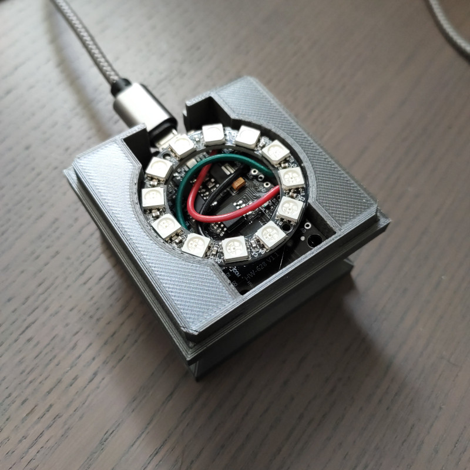

# ESP8266 MQTT-Light

## Whats this?

I wanted some sort of RGB light to signal all sort of things: New emails, high server load... stuff like that. So looked through the electronics stuff I had flying around to see what I can use for this kind of job.

## Components

### Electronics:
- A old ESP8266 board. More than enough for that simple task
- A Adafruit NeoPixel Ring with 12 LEDs

I also had a few unused ESP-01S, but they need 3,3V and I would have needed a converter from 5V to 3.3V plus a USB converter for programming. The "big" ESP8266 Devkit has integrated USB, making SW development and flashing easier and also powers everything over USB. Plus the wiring is much simpler, the LED ring can be directly wired to the ESP without any additional components.

### Mechanics:

Based on dutchmoguls [Elder Sign Nightlight](https://www.thingiverse.com/thing:921962).

I redesigned the base to accommodate the ESP and the LED ring

## Libaries

- FastLED Animation Library: For controlling the LED ring
- ESP8266WiFi: For the WiFi connectivity
- PubSubClient: For MQTT messaging
- ArduinoJSON: For serialisation / deserialisation of JSON strings

## How to use

WiFi credentials (SSID and pass) are hardcoded in secrets.h. The MQTT broker address is set in the define MQTT_BROKER in LEDLamp.ino

When started, the lamp will send its status to MQTT and can receive the following commands send to the /cmd subtopic:

- Set the base color for effects (not always used) with { "setbasecolor": [255,255,0] }
- Set the delay for effects to slow down or speed up: { "setdelay": 1000 }
- Set the color pattern to use { "setpattern": 1 }
  - 0 .. Solid Basecolor
  - 1 .. Rainbow Effect
  - 2 .. Gradient White to Basecolor
  - 3 .. Gradient Black to Basecolor
  - 4 .. Single Dot with Basecolor
  - 5 .. Smoothed Dot with Basecolor
- Set the color effect with { "seteffect": 1 }
  - 0 .. No effect
  - 1 .. Breathe
  - 2 .. Breathe with pause
  - 3 .. Rotate
  - 4 .. Glitter
  - 5 .. Add some noise
  - 6 .. Randomizer (fire effect)

## Todos

- Print a better transparent lid, currently a draft print
